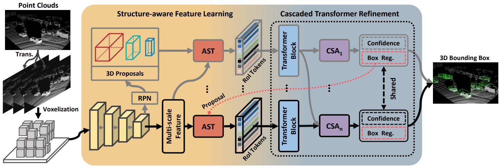

# ASTFormer: Adaptive Structure-aware Tokens based on Cascaded Transformer for 3D Object Detection


This is the code for ASTFormer(Adaptive Structure-aware Tokens based on Cascaded Transformer for 3D Object Detection). 
This code is mainly based on [OpenPCDet](https://github.com/open-mmlab/OpenPCDet), some codes are from [TED](https://github.com/hailanyi/TED), 
[CasA](https://github.com/hailanyi/CasA), [IA-SSD](https://github.com/yifanzhang713/IA-SSD) and [CasA](https://github.com/hailanyi/CasA).

## Detection Framework
In this paper, we propose a novel and more effective 3D object detector called Adaptive Structure-aware
Tokens based on Cascaded Transformer(ASTFormer). Our detector consists of two key design components: 1)
a Adaptive Structure-aware Token Selector (AST) and 2) a Cascade Transformer Refinement network (CTR).
Firstly, AST selectively chooses structure-aware tokens with enhanced boundary discriminative capabilities
for objects with different sparsity levels, accomplished through a supervised task and local token density
information. Secondly, CTR establishes a long-distance dependencies, employing cascaded learning to refine
the representation of local object structures to instance-level features, thereby achieving precise localization
of object bounding boxes. Extensive experiments on the KITTI dataset and Waymo Open Dataset demonstrate that
ASTFormer achieves state-of-the-art 3D detection performance. Specifically, ASTFormer attains 84.40 AP on the
medium difficulty level and 80.84 AP on the hard difficulty level of the KITTI dataset. Notably, ASTFormer
outperforms leading detectors such as OcTr and PG-RCNN by 3.07 and 3.51 AP, respectively, on the hard difficulty
level. The detection frameworks are shown below.




## Getting Started
### Dependency
All the codes are tested in the following environment:
+ Ubuntu 20.04
+ Python 3.9.13 
+ PyTorch 1.8.1
+ Numba 0.53.1
+ [Spconv 2.1.22](https://github.com/traveller59/spconv) # pip install spconv-cu111
+ NVIDIA CUDA 11.1 
+ 1x 3090 GPUs


### Prepare dataset

#### KITTI Dataset
* You can generate the dataset by yourself as follows:
Please download the official [KITTI 3D object detection](http://www.cvlibs.net/datasets/kitti/eval_object.php?obj_benchmark=3d) dataset and organize the downloaded
files as follows (the road planes could be downloaded from [[road plane]](https://drive.google.com/file/d/1d5mq0RXRnvHPVeKx6Q612z0YRO1t2wAp/view?usp=sharing),
which are optional for data augmentation in the training):

```
ASTFormer
├── data
│   ├── kitti
│   │   │── ImageSets
│   │   │── training
│   │   │   ├──calib & velodyne & label_2 & image_2 & (optional: planes)
│   │   │── testing
│   │   │   ├──calib & velodyne & image_2
├── pcdet
├── tools
```

Run following command to creat dataset infos:
```
python3 -m pcdet.datasets.kitti.kitti_dataset create_kitti_infos tools/cfgs/dataset_configs/kitti_dataset.yaml
```

#### Waymo Dataset

```
ASTFormer
├── data
│   ├── waymo
│   │   │── ImageSets
│   │   │── raw_data
│   │   │   │── segment-xxxxxxxx.tfrecord
|   |   |   |── ...
|   |   |── waymo_processed_data_train_val_test
│   │   │   │── segment-xxxxxxxx/
|   |   |   |── ...
│   │   │── pcdet_waymo_track_dbinfos_train_cp.pkl
│   │   │── waymo_infos_test.pkl
│   │   │── waymo_infos_train.pkl
│   │   │── waymo_infos_val.pkl
├── pcdet
├── tools
```

Run following command to creat dataset infos:
```
python3 -m pcdet.datasets.waymo.waymo_tracking_dataset --cfg_file tools/cfgs/dataset_configs/waymo_tracking_dataset.yaml 
```


### Install `pcdet`

Please install `pcdet` by running `python setup.py develop`.

a. Clone this repository.

b. Install the dependent libraries by running `python setup.py develop`


### Training and Evaluation

#### Evaluation

```
cd tools
python3 test.py --cfg_file ${CONFIG_FILE} --batch_size ${BATCH_SIZE} --ckpt ${CKPT}
```

For example, if you test the ASTFormer model:

```
cd tools
python3 test.py --cfg_file cfgs/kitti_models/ASTFormer.yaml --ckpt ASTFormer.pth
```

Multiple GPU test: you need modify the gpu number in the dist_test.sh and run
```
sh dist_test.sh 
```
The log infos are saved into log-test.txt
You can run ```cat log-test.txt``` to view the test results.

#### Training

```
cd tools
python3 train.py --cfg_file ${CONFIG_FILE}
```

For example, if you train the CasA-V model:

```
cd tools
python3 train.py --cfg_file cfgs/kitti_models/ASTFormer.yaml
```

Multiple GPU train: you can modify the gpu number in the dist_train.sh and run
```
sh dist_train.sh
```
The log infos are saved into log.txt
You can run ```cat log.txt``` to view the training process.


## Acknowledgement
[OpenPCDet](https://github.com/open-mmlab/OpenPCDet)

[TED](https://github.com/hailanyi/TED)

[VirConv](https://github.com/hailanyi/TED)

[CasA](https://github.com/hailanyi/CasA)

[IA-SSD](https://github.com/yifanzhang713/IA-SSD)


## Citation

```
@inproceedings{ASTFormer,
    title={Adaptive Structure-aware Tokens based on Cascaded Transformer for 3D Object Detection},
    author={Li, Xinglong and Zhang, Xiaowei},
    booktitle={},
    year={2023}
}
```


